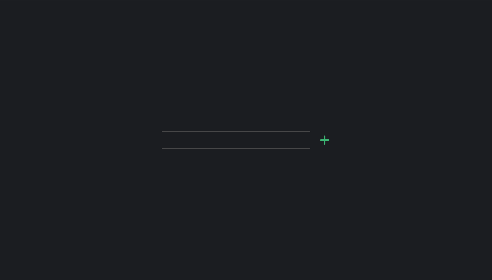
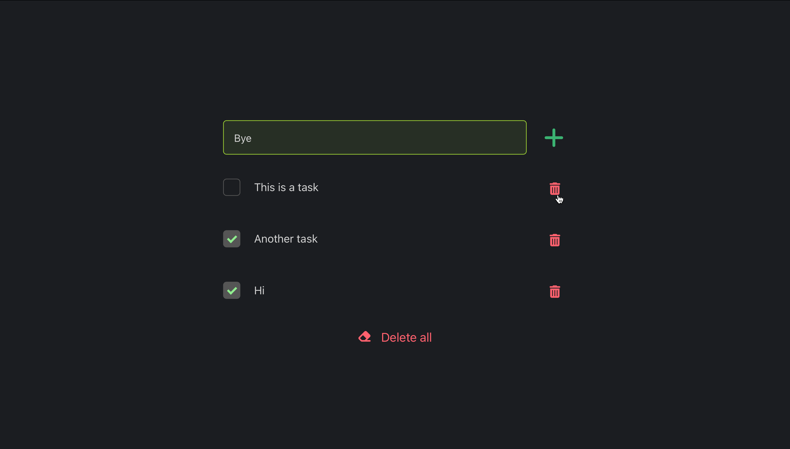
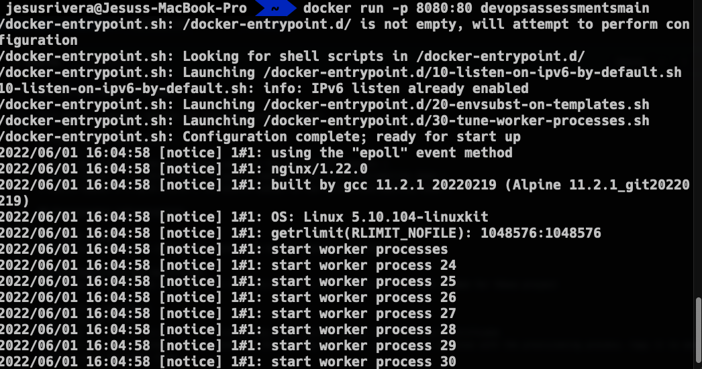
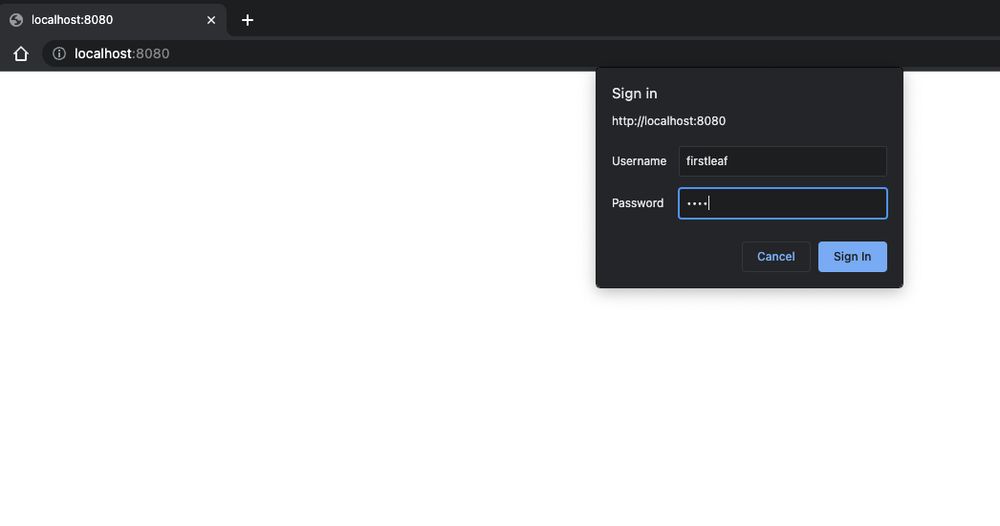
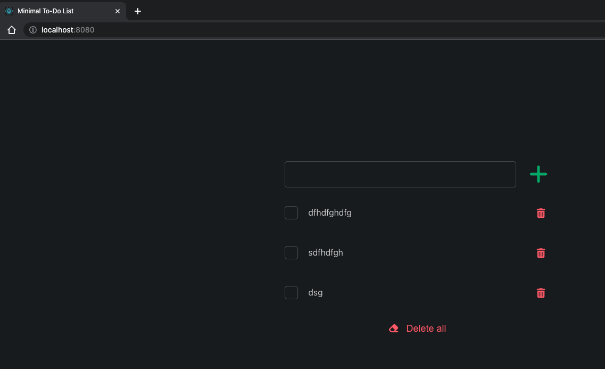

# Write a Dockerfile and run a container

Your task is as follows:

1. Create a Docker image:
  * Use node version 17
  * To install app requirements run `yarn`
  * To build the app run `yarn build`, the production ready app will be stored under `./build` directory
  * Have in mind we want to have the smallest size possible for the final image
  * Make sure the app is served using gzip compression and basic http auth (user:firstleaf, pass:test)
2. Once you wrote the Dockerfile and created an image, run the container and test the application. Describe how did you test it and provide output
3. Write a terraform file to deploy the app to AWS ECS or AWS Beanstalk (you can pick either of the two services)

# App Description and screenshots

## minimal-todo-list

Simple and dark to-do list developed in React

## Output

# Running the container

# Testing Auth

 
# App served in container nginx
